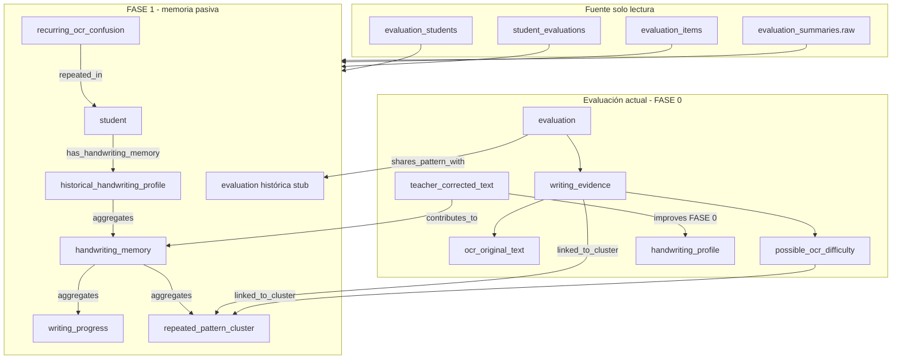

# FASE 1 — Memoria caligráfica histórica (Graph Layer longitudinal)

## Regla de oro — confirmación

| Área | ¿Tocado? |
|------|----------|
| OCR / pipeline OCR | **No** |
| `evaluate` / scoring / puntajes | **No** |
| OMR / QR / cámara | **No** |
| Dashboards | **No** |
| Schema / migraciones Supabase | **No** |
| Reconocimiento de letras (`letter_pattern`) | **No** |
| Identificación de autoría | **No** |
| Commit git | **No** |

**Solo se extendió** la capa de grafo pedagógico en lectura (`buildGraphSnapshot` → API `GET /api/evaluations/[id]/pedagogical-graph`).

---

## Arquitectura propuesta



### Flujo

1. **Identidad**: `student_profile_id` (prioritario) y/o `student_id` del catálogo.
2. **Histórico**: hasta **8** evaluaciones previas del mismo estudiante (mismo `teacher_id` si está disponible), ordenadas por `evaluated_at`.
3. **Firmas livianas** por ítem (sin IA): diff OCR vs texto docente, placeholder vs raw — hash SHA-256 truncado + excerpt ≤ 48 caracteres.
4. **Clusters**: firmas que aparecen en **≥ 2 evaluaciones** → `repeated_pattern_cluster`.
5. **Anti-explosión**: topes en evaluaciones, clusters, aristas `shares_pattern_with` y nodos `recurring_ocr_confusion` (constantes exportadas en el módulo).

---

## Nodos nuevos

| Tipo | ID ejemplo | Rol |
|------|------------|-----|
| `historical_handwriting_profile` | `historical_handwriting_profile:profile:{uuid}` | Perfil longitudinal del estudiante |
| `handwriting_memory` | `handwriting_memory:profile:{uuid}` | Agregado de evidencia histórica (metadata, conteos) |
| `writing_progress` | `writing_progress:profile:{uuid}` | Tendencia heurística mitad temporal (más/menos dificultades OCR o correcciones) |
| `repeated_pattern_cluster` | `repeated_pattern_cluster:profile:{uuid}:{fp}` | Patrón que se repite en varias evaluaciones |
| `recurring_ocr_confusion` | `recurring_ocr_confusion:profile:{uuid}:{fp}` | Subtipo OCR del cluster (máx. 6 nodos) |

Evaluaciones históricas participantes se materializan como nodos `evaluation` **stub** (`historical_reference_only: true`) solo si participan en un cluster, hasta el tope de aristas.

---

## Relaciones nuevas

| Arista | Origen → Destino | Uso |
|--------|------------------|-----|
| `has_handwriting_memory` | `student` → `historical_handwriting_profile` | Enlace longitudinal |
| `aggregates` | perfil/memoria → memoria/progreso/clusters | Jerarquía liviana |
| `shares_pattern_with` | evaluación actual → evaluación histórica | Patrón compartido |
| `repeated_in` | `recurring_ocr_confusion` → `student` | Confusión OCR recurrente |
| `contributes_to` | `teacher_corrected_text` → `handwriting_memory` | Corrección aporta a memoria |
| `linked_to_cluster` | `writing_evidence` / `possible_ocr_difficulty` / cluster → cluster | Evidencia actual al cluster |

FASE 0 se mantiene: `has_handwriting_profile`, `contains_writing_evidence`, `may_need_review`, `improves`, etc.

---

## Qué se implementó

- `app/lib/pedagogical-graph/types.ts` — tipos de nodos/aristas y campos de `summary` FASE 1.
- `app/lib/pedagogical-graph/handwritingHistoricalMemory.ts` — consulta histórico, firmas, clusters, límites, nodos/aristas.
- `app/lib/pedagogical-graph/buildGraphSnapshot.ts` — invoca memoria histórica tras FASE 0.
- `extractItemSignaturesFromEval` exportado para pruebas/reuso.

Metadata típica en nodos: `phase: "1_longitudinal"`, `is_evidence_only: true`, `no_letter_recognition: true`, fingerprints sin texto completo en nodos pesados.

---

## Qué quedó pendiente (fuera de FASE 1)

- Reconocimiento de letras / `letter_pattern:A|B|C`.
- Autoría o comparación entre estudiantes distintos.
- Persistencia de memoria en BD (solo snapshot en tiempo de lectura).
- UI en dashboards para visualizar el grafo longitudinal.
- Embeddings o IA pesada para similitud caligráfica visual.
- Enlace automático cuando falta `student_profile_id` y solo hay `evaluation_student` anónimo.
- Tests unitarios automatizados del módulo histórico.

---

## Cómo probar

```http
GET /api/evaluations/{evaluationId}/pedagogical-graph
```

Revisar en `summary`: `historical_evaluations_included`, `repeated_pattern_clusters`, `recurring_ocr_confusion_count`.

Nodos FASE 1: buscar `type` ∈ `historical_handwriting_profile`, `handwriting_memory`, `repeated_pattern_cluster`.

---

## Verificación

| Comando | Resultado (sesión actual) |
|---------|---------------------------|
| `npx tsc --noEmit` | **OK** (exit 0) |
| `npm run build` | Compilación TypeScript/Next **sin errores en archivos FASE 1**. Builds completos del repo pueden fallar por `ENOENT` en `.next/routes-manifest.json` si hay builds concurrentes o `.next` corrupto (error de infraestructura preexistente, no del grafo). Ejecutar un solo `npm run build` con `.next` limpio si hace falta validar deploy. |

Archivos tocados (solo Graph Layer):

- `app/lib/pedagogical-graph/types.ts`
- `app/lib/pedagogical-graph/handwritingHistoricalMemory.ts` (nuevo)
- `app/lib/pedagogical-graph/buildGraphSnapshot.ts`
- `FASE1_MEMORIA_CALIGRAFICA_ENTREGABLE.md`
